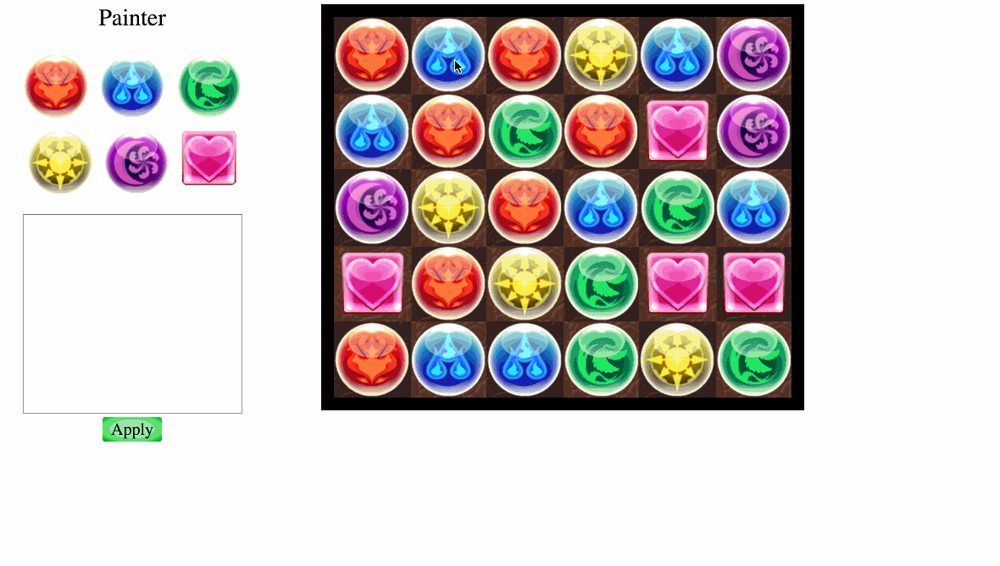
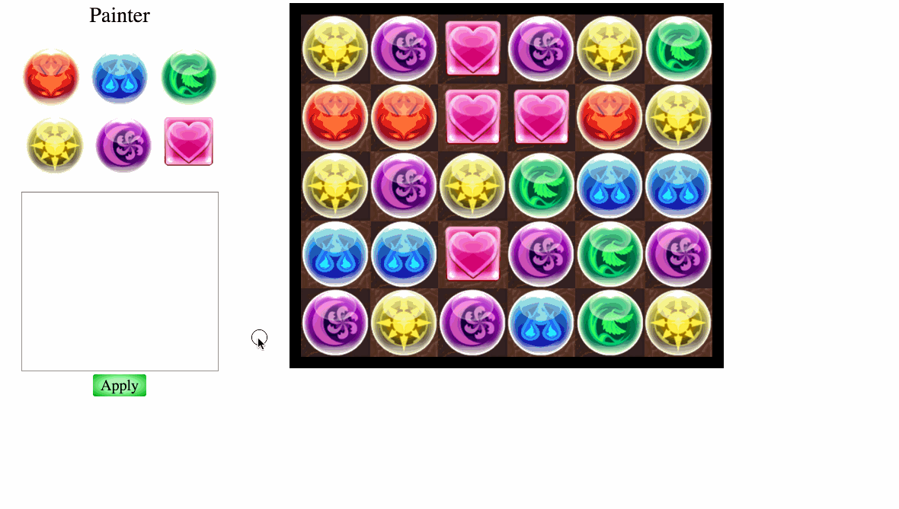

# PAD ([Live](scott-mck.github.io/PAD))

Inspired by the mobile game Puzzle and Dragons, as well as another online
simulator at pad.dawnglare.com.

##Demos
Example of basic orb matching

Example of specific orb painting

Example of entire board painting

